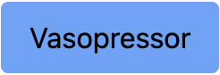
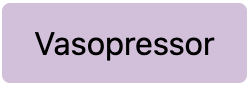
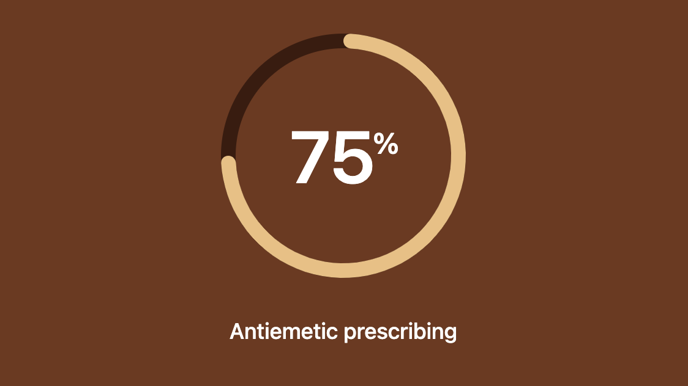

# tailwind-drug-label-colors

## What is this?

This is a theme for [Tailwind CSS](https://tailwindcss.com/) that adds a set of colors for drug labels.

## TL;DR

The block to be added to the `tailwind.config.js` file is:

```javascript
    colors: {
      vasopressor: {
        DEFAULT: "#d6bfdd",
        50: "#fbf8fc",
        100: "#f5f0f7",
        200: "#eee3f1",
        300: "#d6bfdd",
        400: "#cbadd3",
        500: "#b58dbf",
        600: "#a072ab",
        700: "#895d93",
        800: "#734f7a",
        900: "#5d4162",
        950: "#3f2744",
      },
      anticholinergic: {
        DEFAULT: "#a3d55d",
        50: "#f5fbea",
        100: "#e9f6d0",
        200: "#d4eeaa",
        300: "#b6e175",
        400: "#a3d55d",
        500: "#79b52c",
        600: "#5f931f",
        700: "#486e1c",
        800: "#3d591c",
        900: "#324a1c",
        950: "#19290a",
      },
      opioid: {
        DEFAULT: "#71c5e8",
        50: "#f2f9fd",
        100: "#e4f2fa",
        200: "#c2e4f5",
        300: "#71c5e8",
        400: "#4fb8e1",
        500: "#29a0ce",
        600: "#1a80af",
        700: "#16668e",
        800: "#165776",
        900: "#184962",
        950: "#102e41",
      },
      "neuromuscular-blocker": {
        DEFAULT: "#ff7477",
        50: "#fff1f1",
        100: "#ffe1e2",
        200: "#ffc7c8",
        300: "#ffa0a2",
        400: "#ff7477",
        500: "#f83b3f",
        600: "#e51d21",
        700: "#c11418",
        800: "#a01417",
        900: "#84181a",
        950: "#480708",
      },
      hypnotic: {
        DEFAULT: "#ff8200",
        50: "#fffaec",
        100: "#fff4d3",
        200: "#ffe6a5",
        300: "#ffd26d",
        400: "#ffb332",
        500: "#ff9a0a",
        600: "#ff8200",
        700: "#cc5f02",
        800: "#a1490b",
        900: "#823e0c",
        950: "#461d04",
      },
      "local-anaesthetic": {
        DEFAULT: "#afa9a0",
        50: "#f7f6f5",
        100: "#ecebe8",
        200: "#d8d5d0",
        300: "#bfbbb2",
        400: "#afa9a0",
        500: "#92897d",
        600: "#857b71",
        700: "#6f665f",
        800: "#5c5550",
        900: "#4c4642",
        950: "#282422",
      },
      "induction-agent": {
        DEFAULT: "#ffe800",
        50: "#fdffe7",
        100: "#faffc1",
        200: "#f8ff86",
        300: "#fdff41",
        400: "#fff60d",
        500: "#ffe800",
        600: "#d1ac00",
        700: "#a67c02",
        800: "#89600a",
        900: "#744e0f",
        950: "#442a04",
      },
      antiemetic: {
        DEFAULT: "#efbe7d",
        50: "#fdf8ef",
        100: "#fbeed9",
        200: "#f6dab2",
        300: "#efbe7d",
        400: "#e89d4f",
        500: "#e3822c",
        600: "#d46a22",
        700: "#b0511e",
        800: "#8d421f",
        900: "#72371c",
        950: "#3d1a0d",
      },
    },
  },
```

This can be seen _in situ_ in the `tailwind.config.js` file in this repository.

The colors are based on the [ISO 26825:2020 standard](https://www.iso.org/standard/76678.html) with more information in an [AoA guideline](https://anaesthetists.org/Home/Resources-publications/Guidelines/Syringe-labelling-in-anaesthesia-and-critical-care-areas-review-2022) covering the standard for drug label colors.

## Why?

Color coded drug labels are a safety feature in anaesthesia and critical care areas. The colors are standardized to help prevent medication errors. This theme is intended to make it easier to use these colors in web applications.

## How to use

To use this theme, add the block of colors to the `tailwind.config.js` file in your project. Then you can use the colors in your CSS as you would any other Tailwind color.

Take a button...



```html
<button class="bg-blue-400 text-black py-2 px-4 rounded">
  Vasopressor
</button>
```

...and change the color to the vasopressor color.


```html
<button class="m-4 bg-vasopressor text-black py-2 px-4 rounded">
  Vasopressor
</button>
```

Full shades of the color are available, as well as a 950 shade for text.

eg. for a hover effect:

```html
<button class="m-4 bg-vasopressor hover:bg-vasopressor-600 text-black py-2 px-4 rounded">
  Vasopressor
</button>
```

These colors are part of the visual language of the clinical practice of anaesthesia and critical care. Using them in web applications can help to make the applications more familiar and easier to use for clinicians.



The rest of this repo is a standard Vue CLI project with the Tailwind CSS plugin installed. The `tailwind.config.js` file has been modified to include the colors and there is a simple HelloWorld component that demonstrates the use of the colors: this was used as the source of the screenshots above and was used to develop and test the theme.
